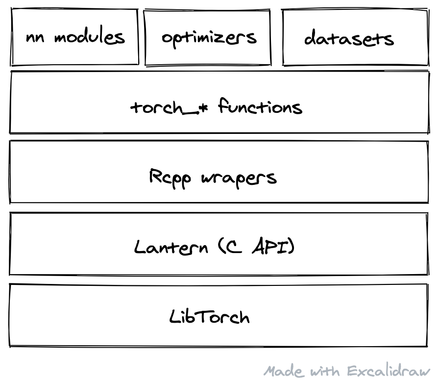
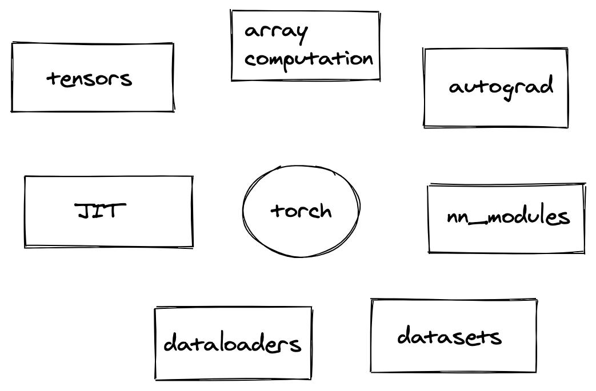
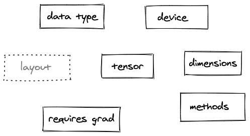

```{r, include=FALSE, context="setup"}
Sys.setenv(TORCH_INSTALL=1)
Sys.setenv(TORCH_HOME=path.expand("libtorch/"))
```

```{r, include=FALSE, context="server-start"}
Sys.setenv(TORCH_INSTALL=1)
Sys.setenv(TORCH_HOME=path.expand("libtorch/"))
```

```{r setup, include=FALSE}
Sys.setenv(TORCH_INSTALL=1)
Sys.setenv(TORCH_HOME=path.expand("libtorch/"))
cat("torch tour logs\n")
library(learnr)
library(torch)
library(torchvision)
library(ggplot2)
library(tibble)
cat("Libraries loaded\n")
set.seed(1)
e <- try(cat("Lantern is started? ", torch:::.globals$lantern_started, "\n"))

if (inherits(e, "try-error")) {
  cat("Failed querying lantern started: ", e)
}

e <- try(cat("Start lantern? Returned NULL?", is.null(torch:::lantern_start()), "\n"))

if (inherits(e, "try-error")) {
  cat("Failed starting lantern: ", e)
}
try(cat("Lantern is started now?? ", torch:::.globals$lantern_started, "\n"))

cat("Lantern install path: ", torch:::install_path(), "\n")

e <- try(x <- torch::torch_randn(1))
if (inherits(e, "try-error")) {
  cat("Can we call somethinf from torch? Failed calling torch with: ", e)
} else {
  cat("Can we call something from torch? YES!", as.numeric(x), "\n")  
}

cat("Maybe require torch again just in case? ", require(torch), "\n")

cat("Now setting torch seed\n")
e <- try(torch::torch_manual_seed(1))

if (inherits(e, "try-error")) {
  cat("Failed setting torch seed with: ", e)
}

cat("Now doing knitr stuff!")
knitr::opts_chunk$set(echo = FALSE)
```

## What is torch?

**torch** is an R package with 2 core features:

-   Array computation with strong GPU acceleration

-   Deep neural networks built on a tape-based autograd system

### Why torch?

::: {.row}
::: {.col-md-6}
-   torch is based on Pytorch, a framework with rapidly increasing
    popularity among deep learning researchers.

-   We believe others can use torch's GPU acceleration to implement fast
    machine learning algorithms using its convenient interface.

-   torch is flexible and has a low level API, making it useful for a
    vast range of use cases, not only for deep learning.

    </div>

    <div class="col-md-6">


section.](images/Screen%20Shot%202020-11-01%20at%2017.07.12.png){width="100%"}
:::
:::

### How is it implemented?

Before going into code it's nice to understand the basics of how torch
is implemented in R.

::: {.row}
::: {.col-md-6}
-   Almost all `torch_*` functions are auto-generated from Libtorch's
    declaration file. This means that all low level operations are
    automatically available in the R package.

-   Most neural-network module, optimizer, dataset and dataloader code
    is written in R. It's easy to inspect the code and use it to write
    your own customizations.

-   The diagram on the right shows Libtorch at the bottom, and above it
    all the layers implemented to allow using torch from R.

-   In contrast to TensorFlow for R, which is built on top of the Python
    implementation via `reticulate`, torch is built on top of Libtorch,
    the C++ API of Pytorch. Thus, `torch` has no Python dependency.

    </div>

    <div class="col-md-6">

{width="100%"}
:::
:::

### Installation

The torch R package is available on CRAN and can be installed with:

    install.packages("torch")

When the package is first loaded with `library(torch)`, additional
libraries will be downloaded and installed to complete the installation.

See our [installation
guide](https://torch.mlverse.org/docs/articles/installation.html) for
more information.

## torch components

The torch package has a few core components that we will discuss in this
tutorial.

::: {.row}
::: {.col-md-6}
{width="100%"}
:::
:::

Some of the components can be classified as low-level. For example:

-   **Tensors**: a multi-dimensional array container. Tensors are used
    to represent data and parameters in torch.

-   **Array computation library**: torch includes more than 200
    functions that can be used to transform tensors, including
    mathematical operations, structure transformations, etc.

-   **Autograd**: allows computing exact derivatives of tensor
    operations. This is essential in allowing torch to be used for
    machine learning.

torch also provides higher level abstractions that make it easier to
build larger programs:

-   **Neural network modules**: `nn_modules` are a higher level
    abstraction making it easy to handle state when composing many
    tensor operations.

-   **Datasets**: an abstraction for loading data in torch. It allows
    handling data that you might not be able to load entirely into a
    single tensor because of memory limitations.

-   **Dataloaders**: simplifies loading a dataset into batches and
    allows distributing data-loading into multiple processes.

## Creating tensors {data-progressive="TRUE"}

Tensors are the core data structure in torch.

### From R objects

Tensors can be created from R atomic vectors, matrices and arrays using
the `torch_tensor` function:

```{r atomic, exercise=TRUE}
x <- torch_tensor(c(1,2,3))
x
```

```{r matrix, exercise=TRUE}
m <- matrix(runif(6), nrow = 2)
x <- torch_tensor(m)
x
```

```{r array, exercise=TRUE}
a <- array(runif(12), dim = c(2, 3, 2))
x <- torch_tensor(a)
x
```

### Using initialization functions

Tensors can also be created using torch initialization functions. The
first argument for most initialization functions is a sequence of
integers indicating the shape of the tensor.

```{r randn, exercise=TRUE}
x <- torch_randn(2,2)
x
```

Other functions to create tensors are:

-   `torch_arange`: Returns a tensor with a sequence of integers,
-   `torch_full`: Returns a tensor filled with a single value,
-   `torch_ones`: Returns a tensor filled with all ones,
-   `torch_rand`: Returns a tensor filled with values drawn from a
    uniform distribution on [0, 1).
-   `torch_randn`: Returns a tensor filled with values drawn from a unit
    normal distribution,
-   `torch_zeros`: Returns a tensor filled with all zeros.

You can see the full list
[here](https://torch.mlverse.org/docs/articles/tensor-creation.html#using-creation-functions-1).

Feel free to experiment with other initialization functions below:

```{r experiment, exercise=TRUE}


```

### Converting back to R

torch provides methods to convert tensors back to R.

```{r backr, exercise=TRUE}
# as.array is the most general method and allows
# converting any type of tensor
x <- torch_randn(2,2)
as.array(x)
```

You can also use `as.matrix`, `as.numeric`, `as.integer` and etc.

## Tensor attributes {data-progressive="TRUE"}

Every tensor has a few attributes that determine how data is stored in
the computer. The most important attributes are described below:

<!-- <div class = "row"> -->

<!-- <div class="col-md-6"></div> -->

<!-- <div class="col-md-6"></div> -->

<!-- </div> -->

::: {.row}
::: {.col-md-6}
-   **data type**: describes how the bytes in the fixed-size block of
    memory corresponding to an array item should be interpreted. For
    example: int, float, double, etc.
-   **device**: describes on which device the memory corresponding to
    that tensor lives. For example: a **cuda** device, or **cpu**.
    Operations on tensors happen on the devicewhere the data is located.
-   **dimensions**: describes the shape of the tensor.
-   **requires_grad**: a flag indicating if operations on that tensor
    should be recorded to allow for automatic gradient computation in
    the future.
:::

::: {.col-md-6}
{width="100%"}
:::
:::

### Accessing attributes

Tensor attributes can be accessed using the `$` operator:

```{r dtype, exercise=TRUE}
x <- torch_randn(2,2)
x$dtype
```

```{r device, exercise=TRUE, exercise.setup="dtype"}
x$device
```

```{r shape, exercise=TRUE, exercise.setup="dtype"}
x$shape
```

```{r req_grad, exercise=TRUE, exercise.setup="dtype"}
x$requires_grad
```

### Modifying attributes

The default tensor attributes can be modified when creating the tensors,
or later, using the `$to` method.

```{r cre, exercise=TRUE}
x <- torch_randn(2,2, dtype = torch_float64())
x
```

```{r to, exercise=TRUE}
x <- torch_randn(2,2)
x <- x$to(dtype = torch_float16())
x
```

The `$to` method creates a copy of that tensor with modified attributes.

### CUDA devices

Moving between devices is also done with the `$to` method, but only
`cpu` devices are available to all systems. CUDA devices are only
available if your system is equipped with a compatible GPU. You can
check if a CUDA device is available with:

```{r cuda, exercise=TRUE}
cuda_is_available()
```

A common pattern in torch is to create a device object at the beginning
of your script and reuse it as you create and move tensors. For example:

```{r cuda2, exercise=TRUE}
device <- if (cuda_is_available()) "cuda" else "cpu"

x <- torch_randn(2, 2, device = device)
y <- x$to(device = device)
```

Moving between devices is an important operation because tensor
operations happen on the device the tensor is located; so if you want to
use the fast GPU implementations, you need to move tensors to the CUDA
device.

### Exercise

Create a tensor with the `torch_bool()` data type and cast it to
`torch_double()` using the `$to()` method.

```{r booldouble, exercise=TRUE, exercise.eval=FALSE}


```

## Indexing tensors {data-progressive="TRUE"}

Indexing tensors in torch is very similar to indexing vectors, matrices
and arrays in R --- with an important difference when using **negative**
indexes.

In torch negative indexes don't remove the element, instead selection
happens starting from the end. We decided in favor of this behavior
because it seems that selecting starting from the end is more frequently
used than removing elements in torch applications.

Considering a tensor with:

```{r index1, exercise=TRUE}
x <- torch_tensor(1:5)
x
```

```{r index2, exercise=TRUE, exercise.setup="index1"}
# takes the first element
x[1]
```

```{r index3, exercise=TRUE, exercise.setup="index1"}
# negative index: take the first element starting from end, ie. last element
x[-1]
```

### Selecting intervals

torch also supports indexing tensors by interval, using boolean and
integer tensors, as well as R vectors. See the examples below:

```{r index4, exercise=TRUE}
x <- torch_tensor(1:5)
x
```

```{r index5, exercise=TRUE, exercise.setup="index4"}
# selecting the first 3 elements
x[1:3]
```

```{r index6, exercise=TRUE, exercise.setup="index4"}
# selecting the from the third element until the end. the `N` syntax is syntactic sugar for the last index.
x[3:N]
```

```{r index7, exercise=TRUE, exercise.setup="index4"}
# selecting the last 2 elements
x[-2:N]
```

```{r index8, exercise=TRUE, exercise.setup="index4"}
# selecting using a boolean tensor
x[x>2]
```

### Multi-dimensional selections

When indexing a tensor with multiple dimensions, you can use
dimension-specific indices separated by commas, just like in R. For
example:

```{r index9, exercise=TRUE}
x <- torch_randn(2, 2, 3)
dim(x)
```

```{r index10, exercise=TRUE, exercise.setup = "index9"}
# selecting the first element in every dimension
x[1, 1, 1]
```

```{r index11, exercise=TRUE, exercise.setup = "index9"}
# you can select everything from a dimension by using an empty argument.
x[,,1]
```

```{r index12, exercise=TRUE, exercise.setup = "index9"}
# you can use .. when you want to take all elements from all dimensions until the last.
x[..,1]
```

```{r index13, exercise=TRUE, exercise.setup = "index9"}
# you can also add a new dimension using the `newaxis` sugar
x[..,newaxis]
```

```{r index14, exercise=TRUE, exercise.setup = "index9"}
# by default when you select a single element from a dimension, it's dropped. 
# you can change this behavior by setting drop = FALSE
x[1,..,drop=FALSE]
```

```{r index15, exercise=TRUE, exercise.setup = "index9"}
# subset assignment is also supported
x[1,1,1] <- 0
x[1,1,1]
```

## Array computation {data-progressive="TRUE"}

torch provides more than 200 functions and methods that operate on
tensors. They range from mathematical operations to utilities for
reshaping and modifying tensors.

Most operations have both CPU and GPU backends, and torch will use the
backend corresponding to the tensor device.

See some examples below:

```{r ac1, exercise=TRUE}
x <- torch_tensor(c(1, 2, 3))
torch_sub(x, 1)
```

```{r ac2, exercise=TRUE, exercise.setup="ac1"}
# many torch_* functions have a corresponding tensor method
# you can choose the syntax that you like the most
x$sub(1)
```

```{r ac3, exercise=TRUE, exercise.setup="ac1"}
# methods that have an `_` suffix by convention 
# will operate in-place
x$sub_(1)
x
```

```{r ac4, exercise=TRUE, exercise.setup="ac1"}
torch_log(torch_exp(x))
```

You can find the full list of functions on the [documentation
website](https://torch.mlverse.org/docs/reference/index.html#section-mathematical-operations-on-tensors).

### Reduction functions

Many functions in torch have a `dim` argument that describes the
dimension or dimensions to reduce when doing the specified operation.

For example:

```{r ac5, exercise=TRUE}
x <- torch_tensor(rbind(c(1,2,3), c(4,5,6)))
x
```

```{r ac6, exercise=TRUE, exercise.setup="ac5"}
# reduces the first dimension. ie. sum all rows for each column
torch_sum(x, dim = 1)
```

```{r ac7, exercise=TRUE, exercise.setup="ac5"}
# reduces the 2nd dimension. ie. sum all columns for each row
torch_sum(x, dim = 2)
```

This behavior can be confusing at first because it's semantically
different from R `apply`, which can be interpreted as a 'group by'
operation instead.

### Broadcasting

Broadcasting allows us to use tensors of different shapes when executing
binary/arithmetic operations. torch follows the same broadcasting rules
as Numpy, and we recommend reading [this
article](https://numpy.org/doc/stable/user/theory.broadcasting.html#array-broadcasting-in-numpy)
for a more detailed explanation.

```{r ac8, exercise=TRUE}
# simplest broadcasting example
torch_tensor(c(1,2,3)) + 1
```

The scalar valuesis broadcasted and added to all elements.

```{r ac9, exercise=TRUE}
# adding a (3,2) matrix to a (2) vector
torch_ones(3,2) + torch_tensor(c(1,2))
```

```{r ac10, exercise=TRUE}
# broadcasting fails when the last dimensions don't match.
torch_ones(2,3) + torch_tensor(c(1,2))
```

```{r ac11, exercise=TRUE}
# A dangerous situation! adding a (10,1) matrix to a 10 vector
torch_ones(10,1) + torch_tensor(runif(10))
```

## What's Autograd? {data-progressive="TRUE"}

Autograd allows torch to compute exact derivatives of tensor operations
with minimal code changes. It's the central feature for making torch
useful for training neural network models.

Suppose we have the operation $y = x^3$ and we want to compute the
derivative $\frac{d y}{d x}$ for a point $x=2$.

In torch we can do:

```{r ag1, exercise=TRUE}
# create `x`. note that **requires_grad** equals TRUE
x <- torch_tensor(2, requires_grad = TRUE)
# compute `y` as usual
y <- x^3
# call backward(): this populates the `grad` attribute 
# of tensors that are needed to compute `y` and that require grad.
y$backward()
# find the derivative dy/dx
x$grad
```

The result is $12$. That's
[because](https://www.wolframalpha.com/input/?i=d%2Fdx+y+%3D+x%5E3)
$\frac{d y}{d x} = 3x ^2$, and we are computing $\frac{d y}{d x}$ for
$x=2$.

### Disabling autograd

It might be useful to disable autograd for a few operations, for
example, when you are performing inference on a model.

For that purpose, there are `with` contexts that allow
disabling/enabling autograd:

```{r ag2, exercise=TRUE}
x <- torch_tensor(2, requires_grad = TRUE)
with_no_grad({
  y <- x^3  
})
# fails: there is no operation tracked by autograd
y$backward() 
```

In less common situations you might need to use `with_enable_grad()` to
enable autograd inside a `with_no_grad()` expression.

### A slightly more advanced example

Suppose now that we have a function $f(x) = 3x^2 - 2x$ and we want to
find it's minimum using gradient descent.

We define this function in R with:

```{r ag3, exercise=TRUE}
f <- function(x) {
  3*x ^ 2 - 2*x
}
```

Next we are going to use the [gradient
descent](https://en.wikipedia.org/wiki/Gradient_descent) algorithm to
find its minimum.

::: {.alert .alert-warning}
There are 3 **very important** details when updating the weights:

------------------------------------------------------------------------

1.  We must disable autograd (using `with_no_grad`) when updating
    weights, because we don't want autograd to track the weight updating
    operation, as we don't want to back-propagate this operation later.

2.  The update operation must happen **in-place** on the weight tensor,
    otherwise this tensor is no longer a leaf tensor and torch can no
    longer back-propagate gradients for it.

3.  We must manually erase the gradients that we just used to update the
    tensors, usually by setting them to zero. This must also happen
    in-place, by using, for example, `x$grad$zero_()`. By default torch
    accumulates gradients after backward, and in general we want
    to start afresh the gradient accumulation after the weight update.

The torch `optim_` functions will help us not having to remember all the
details.
:::

```{r ag4, exercise=TRUE, exercise.setup="ag3"}
lr <- 0.1 # we define a learning rate
num_iter <- 20 # number of iterations

x <- torch_randn(1, requires_grad = TRUE) # we start with a random number x

for (i in seq_len(num_iter)) {
  y <- f(x)
  y$backward()
  with_no_grad({
    x$sub_(lr*x$grad)
    x$grad$zero_()
  })
}

x
```

If we make a plot of that function, we can easily see that this value
corresponds to the minimum:

```{r ag5, exercise = TRUE, exercise.setup="ag4"}
df <- tibble(x = as.numeric(x), y = f(x))

ggplot(df, aes(x = x, y = y)) +
  geom_point(color = "red", size = 2) +
  stat_function(fun = f) +
  xlim(-2, 2) +
  labs(x = "x", y = "f(x)")
```

## Optimizers

torch optimizers are torch's abstraction to encapsulate weight-updating
logic. There are a few readily available optimizers, like *Adam*,
*Adagrad* and *SGD*, but it's also possible to create custom optimizers.

First, let's come back to the example we used in the autograd chapter.
In this example we manually updated the weights using the simplest form
of the gradient descent algorithm.

The logic for updating the weights is wrapped in the `with_no_grad`
block.

```{r opt1, exercise=TRUE, exercise.setup="ag3"}
lr <- 0.1 # we define a learning rate
num_iter <- 20 # number of iterations

x <- torch_randn(1, requires_grad = TRUE) # we start with a random number x

for (i in seq_len(num_iter)) {
  y <- f(x)
  y$backward()
  
  # ---- -> updating the weights
  with_no_grad({
    x$sub_(lr*x$grad)
    x$grad$zero_()
  })
  # ---- <- updating the weights
}

x
```

Let's now rewrite this piece of code using the packaged torch
optimizers.

```{r opt2, exercise=TRUE, exercise.setup="ag3"}
lr <- 0.1 # we define a learning rate
num_iter <- 20 # number of iterations

x <- torch_randn(1, requires_grad = TRUE) # we start with a random number x

# we create the optimizer here and the first argument is a list
# of weights that we want to optimize. It also takes a learning rate (`lr`) 
# argument.
opt <- optim_sgd(x, lr = lr)

for (i in seq_len(num_iter)) {
  opt$zero_grad() # refreshs the `grad` attribute of all parameters
  y <- f(x)
  y$backward()
  opt$step() # performs one update step for all parameters 
}

x
```

Note that we no longer need to wrap our calls in `with_no_grad`, nor
manually perform the update step with an in-place operation. The
optimizer takes care of all of these implementation details. We still
need to compute the loss and use the `$backward()` method to populate
the `grad` attribute of the each parameter.

This also allows you to easily switch optimizers. As an exercise, try
using the Adam optimizer in the above chunk.

## Neural network modules {data-progressive="TRUE"}

In torch all layers and models are called neural network modules , or
for short, `nn_module`s.

In general we can think of deep learning layers and models as functions
that operate on tensors. These functions have a special technical
feature though: They have a state, and their state (i.e., the weights
and parameters) is mutable (the weights change during training).

`nn_module`s make it easy to handle state within layers and models, and
provide a convenient way to separate weight initialization from the
actual transformations.

### Implemented `nn_module`s

torch provides implementations of many of the most common neural network
layers, like convolutional, recurrent, pooling and activation layers, as
well as common loss functions.

All implemented neural network modules have an `nn_*` prefix to make
them easier to discover.

`nn_module`s are like function factories (we are going to implement a
`nn_module` from scratch in the next chapter), but first let's take a
look at the built-in `nn_linear` module.

The linear module applies an affine transformation to the input data,
i.e .it does $f(x) = Wx + b$, where $W$ and $b$ are weights/parameters
of the module.

First we create an instance of the `nn_linear` module. We pass the
parameters `in_features` and `out_features` that are defining the shape
of the $W$ matrix.

```{r nnn1, exercise=TRUE}
linear <- nn_linear(in_features = 10, out_features = 1)
linear
```

The `print` method of the `nn_module` instance shows important
information, like the number of parameters and their structure.

Now we can use it with:

```{r nnn2, exercise=TRUE, exercise.setup="nnn1"}
x <- torch_randn(3, 10)
linear(x)
```

Instances of `nn_modules` also have methods that are useful; for
example, to inspect their parameters or move them to a different
device).

```{r nn4, exercise = TRUE, exercise.setup="nnn1"}
# Lists all parameters in an instance of an `nn_module`
str(linear$parameters)
```

```{r nn5, exercise = TRUE, exercise.setup="nnn1"}
# Access individual parameters
linear$weight
linear$bias
```

```{r nn6, exercise = TRUE, exercise.setup="nnn1"}
# Moves the parameters to the specified device
linear$to(device = "cpu")
```

torch has many built-in `nn_modules` that commonly used. For example:

-   `nn_conv2d`: Applies a 2D convolution over an input signal composed
    of several input planes.
-   `nn_lstm`: Applies a multi-layer long short-term memory (LSTM) RNN
    to an input sequence.
-   `nn_max_pool2d`: Applies 2D max pooling over an input signal
    composed of several input planes.

You can find the full list in the reference documentation available
[here](https://torch.mlverse.org/docs/reference/index.html#section-neural-network-modules).

### Custom `nn_modules`

Let's build a linear model using the `nn_module` abstraction. We use the
`nn_module` function in R. We need to pass 2 functions:

-   `initialize`: The initialize method is an arbitrary function that is
    mostly used to initialize the parameters of the model. It can take
    any number of parameters. It has access to the `self` that can be
    used to share state between methods.

-   `forward`: The `forward` method describes the transformation that
    the `nn_module` is going to perform on input data. It can also be a
    function with an arbitrary number of parameters. It , too, can use
    the `self` object to access parameters that were defined in
    `initialize`.

Internally `nn_modules` are R6 classes, so if you are already familiar
with [R6 classes](https://adv-r.hadley.nz/r6.html), all your knowledge
can be applied.

In this chunk we define an `nn_module`. Defining an `nn_module` is
similar to defining a function, in the sense that no actual computation
happens at that time. The returned object is what we call a 'constructor' of
instances of that module.

```{r nn, exercise=TRUE}
Linear <- nn_module(
  initialize = function(in_feat, out_feat) {
    self$w <- nn_parameter(torch_randn(in_feat, out_feat))
    self$b <- nn_parameter(torch_zeros(out_feat))
  },
  forward = function(input) {
    torch_mm(input, self$w) + self$b
  }
)
```

Once we have defined the `Linear` `nn_module` we can now create an
instance of it. When we call the `nn_module` factory object as a
function, we are actually calling the `initialize` method that we
defined earlier. (Or in `R6`-classes speak, we would be calling `$new()`
method).

```{r nn2, exercise = TRUE, exercise.setup="nn"}
lin <- Linear(in_feat = 10, out_feat = 1)
lin
```

We now have an instance of the `Linear` module that is called `lin`. We
are now able to use this instance to actually perform the linear model
computation on a tensor. We use the instance as an R function, but it
will actually delegate to the `forward` method that we defined earlier.

```{r nn3, exercise=TRUE, exercise.setup="nn2"}
x <- torch_randn(3, 10)
lin(x)
```

### Combining multiple modules

`nn_modules` can also include sub-modules ,and this is what allows us to
write modules using the same abstraction that we use to write layers.

For example, let's build a multi-layer perceptron module with a ReLu
activation.

```{r nn4z, exercise=TRUE}
nn_mlp <- nn_module(
  initialize = function(in_feat, hidden_feat, out_feat) {
    self$fc1 <- nn_linear(in_feat, hidden_feat)
    self$relu <- nn_relu()
    self$fc2 <- nn_linear(hidden_feat, out_feat)
  },
  forward = function(input) {
    input %>% 
      self$fc1() %>% 
      self$relu() %>% 
      self$fc2()
  }
)
mlp <- nn_mlp(10, 5, 1)
mlp
```

Calling the model with an example input tensor works as expected, too:

```{r nn5s, exercise=TRUE, exercise.setup="nn4z"}
x <- torch_randn(3, 10)
mlp(x)
```

You can see that now the print method is showing the number of
parameters of the model, including all sub-modules. The `parameters`
attribute also lists all parameters, including those of the sub-modules:

```{r nn6s, exercise=TRUE, exercise.setup="nn4z"}
mlp$parameters
```

::: {.alert .alert-warning}
In torch there's no difference between module and models, i.e., an
`nn_module` can be as low-level as a ReLu activation, or a much
higher-level ResNet model.
:::

### Sequential modules

When the `forward` method in the `nn_module` just calls the submodules
in a sequence like in the `mlp` example, you can use the `nn_sequential`
container to skip writing the `forward` method:

```{r nns, exercise = TRUE}
mlp <- nn_sequential(
  nn_linear(10, 5),
  nn_relu(),
  nn_linear(5, 1)
)
mlp
```

The `mlp` module defined here is equivalent to the one we wrote in the
previous chapter.

### Functional API

Most `nn_*` modules have a `nnf_*` counterpart, for example,
`nnf_relu()` and `nn_relu()`.

Sometimes the functional API is more convenient, specially if the module
counterpart does not include parameters, because it allows you to avoid
initializing the module.

::: {.alert .alert-warning}
Be careful with `nnf_*` functions when you want to have different
behaviors between training and validation modes, for example, with
`nnf_dropout()`. In those cases it's better to use the `nn_*` module
counterpart, as that will handle the training and evaluation mode
internally.
:::

### Example: training a linear model

Let's use everything we learned until now to train a linear model on
simulated data. First, let's simulate a data set. We will generate a
matrix with 100 observations of 3 variables, all randomly generated from
the standard normal distribution. The response tensor will be generated
using the equation: $y = 0.5 + 2*x_1 -3*x_2 + x_3 + noise$ We also add a
small amount of noise sample from $N(0, 0.1)$.

```{r lm, exercise = TRUE}
x <- torch_randn(100, 3)
y <- 0.5 + 2*x[,1] - 3*x[,2] + x[,3] + torch_randn(100)/10
y <- y[,newaxis] # we want y dimensions to be 100x1
```

We now define our model and optimizer:

```{r, lm2, exercise=TRUE, exercise.setup="lm"}
model <- nn_linear(in_features = 3, out_features = 1)
model
```

```{r lm3, exercise=TRUE, exercise.setup="lm2"}
opt <- optim_sgd(model$parameters, lr = 0.1)
```

Finally, we write our training loop:

```{r, lm4, exercise=TRUE, exercise.setup="lm3"}
for (iter in 1:10) {
  opt$zero_grad()
  pred <- model(x)
  loss <- nnf_mse_loss(y, pred)
  loss$backward()
  opt$step()
  cat("Loss at step ", iter, ": ", loss$item(), "\n")
}
```

We can finally see the final parameter values. Compare them to the
theoretical values and they should be similar to the values we used to
simulate our data.

```{r lm5, exercise = TRUE, exercise.setup="lm4"}
model$weight
model$bias
```

Finally, we can use the `torch_save` function to save our final model to
a file on disk.

::: {.alert .alert-warning}
**Note** that `saveRDS` doesn't work correctly for torch models.
:::

```{r lm6, exercise = TRUE, exercise.setup="lm5"}
torch_save(model, "model.pt")
```

To reload the model, use the `torch_load` function.

##### Exercise:

Modify the above code chunks to fit a multi-layer perceptron instead of
a linear model.

## Datasets and dataloaders {data-progressive="TRUE"}

`torch_dataset` is the object representing data in torch. There are a
few datasets that are already implemented in the torch ecosystem, and
you can also implement your own.

Let's first take a look at the MNIST dataset available in the
`torchvision` package. The MNIST dataset consists of images of
handwritten digits from 0 to 9.

We can create the dataset using the `mnist_dataset()` function. When we
first run this function, the dataset will be downloaded and cached on
the path specified by the `root` argument.

```{r mn, exercise=TRUE}
# might take some time to run, because it downloads the dataset
mnist <- mnist_dataset(root = "data-raw/mnist", download = TRUE)
length(mnist)
```

The `length` function reports the number of observations in the dataset.
We can also subset the dataset with:

```{r mn1, exercise=TRUE, exercise.setup="mn"}
str(mnist[1])
```

This returns the first observation in the dataset, which is a pair of an
image of size 28x28 and its label.

### Custom datasets

A new `torch_dataset` can be created using the `dataset` function, which
requires the following 3 functions as arguments:

-   `initialize`: this function takes inputs for your dataset
    initialization. It can have an arbitrary number of arguments.
-   `.getitem`: this function takes a single integer index as input, and
    returns an observation of the dataset.
-   `.length`: this function takes no arguments, and returns the total
    number of observations in the dataset.

Let's see an example below:

```{r dataset, exercise=TRUE, exercise.lines=20}
mydataset <- dataset(
  # The initialize function takes the number of rows 
  # and columns and initializes 2 tensors (x, y) sampled
  # from the standard normal distribution.
  initialize = function(n_rows, n_cols) {
    self$x <- torch_randn(n_rows, n_cols)
    self$y <- torch_randn(n_rows)
  },
  # We subset the previously initialized `x` and `y`
  # using the index provided as argument.
  .getitem = function(index) {
    list(self$x[index,], self$y[index])
  },
  # We find the number fo rows by looking at the shape
  # of the initialized tensor `x`.
  .length = function() {
    self$x$shape[1]
  }
)
```

The `dataset` function creates a definition of how to initialize and get
elements from a dataset and compute its length. We can now initialize a
new dataset and start extracting elements from it:

```{r dataset2, exercise=TRUE, exercise.setup="dataset"}
# This calls the `initialize` function defined earlier
# with the provided parameters.
ds <- mydataset(n_rows = 100, n_cols = 5)
```

```{r dataset3, exercise=TRUE, exercise.setup="dataset2"}
# This computes the `length` of the dataset using the .length
# function we defined earlier
length(ds)
```

```{r dataset4, exercise=TRUE, exercise.setup="dataset2"}
# This extracts the first observation of the dataset. It's
# equivalent to calling ds$.getitem(1)
ds[1]
```

### Common patterns

The `dataset()` function allows us to define data loading and
pre-processing in a very flexible way. We can decide how to implement
the `dataset` in the way it works best for our problem.

Here are a few common patterns used when creating datasets in torch.

-   The `initialize` method can be used to download, cache and do some
    pre-processing on the data. You can see an example in the
    `mnist_dataset()` [implementation
    provided](https://github.com/mlverse/torchvision/blob/37aa523ee0a3846535d735099cfab45af5336472/R/dataset-mnist.R#L31-L54)
    in the `torchvision` package. In the `mnist_dataset()` we download
    the dataset that is stored in a cloud bucket and pre-process it to
    convert from the pascal_vincent format to an `.rds` file, which then
    is pre-loaded.

-   Sometimes the full dataset doesn't fit completely on RAM. It's
    common for the `initialize` method to only define what are the
    observations (eg. define all paths to images stored on disk), and
    then we use the `.getitem` method to read that image from disk. This
    pattern is implemented in the `folder_dataset()` available in the
    `torchvision` package; you can see it
    [here](https://github.com/mlverse/torchvision/blob/37aa523ee0a3846535d735099cfab45af5336472/R/folder-dataset.R#L89-L103).

-   It's common for datasets to provide a `transform` argument in the
    `initialize` method. These are applied as a last step in the
    `.getitem` method. This allows the dataset user to specify
    additional task-specific pre-processing or data augmentation
    techniques.

### Dataloaders

Dataloaders are torch's abstraction used to iterate over datasets in
batches, and optionally shuffle and prepare data in parallel.

A dataloader is created by passing a dataset instance to the
`dataloader()` function. Let's take the MNIST dataset implemented in the
`torchvision` package:

```{r dl1, exercise = TRUE}
# taking the validation dataset
mnist <- mnist_dataset(root = "data-raw/mnist", download = TRUE, train = FALSE)
dl <- dataloader(mnist, batch_size = 32, shuffle = TRUE)
length(dl)
```

`length()` returns the number of batche we can to extract from the
dataloader.

Indeed, if we take the size of the MNIST validation dataset (10k obs)
and divide by the batch size (32), we see that we can take 313 batches.

```{r dl2, exercise = TRUE, exercise.setup="dl1"}
length(mnist) / 32
```

Dataloaders can be iterated on using the `coro::loop()` function
combined with a `for` loop. The reason we need `coro::loop()` is that
batches in `dataloaders` are only computed when they are actually used,
to avoid large memory usage.

```{r dl22, exercise = TRUE, exercise.setup="dl2"}
total <- 0
coro::loop(for (batch in dl) {
  total <- total + batch$x$shape[1]
})
total
```

You can think of dataloaders as an object similar to an R list with the
important difference that the elements are not actually computed yet,
and they get computed every time you loop trough it.

Dataloaders can optionally load data in parallel with minimal code
changes. In general you only need to use the `num_workers` argument to
specify the number of parallel R sessions that will be used to load
data.

Keep in mind that dataloaders take *batches* in parallel (not
observations), so the time to take the first batch should remain the
same in both serial and parallel approaches. Thus, speedups can only be
seen when taking *multiple batches*.

Also note that parallel processing adds some overhead, like initializing
the R sessions and moving data between processes; so it's recommended to
benchmark which approach is faster for your use case.

## Next steps

This tutorial has presented a general overview of torch and its
components. You can now navigate through the torch documentation
available on the official [website](https://torch.mlverse.org).

You might be interested in reading the [Guess the correlation dataset
tutorial](https://torch.mlverse.org/start/) for a fun introductory
example about torch, and browsing the RStudio AI blog for a number of
end-to-end tutorials for different kind of problems. See the list below:

### Image recognition

-   [Bird
    classification](https://blogs.rstudio.com/ai/posts/2020-10-19-torch-image-classification/)
    is a multi-class classification task. In addition to being a
    blueprint for doing classification with torch, this introductory
    example shows how to load data, make use of pre-trained models, and
    benefit from learning rate schedulers.

-   [Brain image
    segmentation](https://blogs.rstudio.com/ai/posts/2020-11-30-torch-brain-segmentation/)
    builds a U-Net from scratch. This intermediate-level example is a
    great introduction to building your own modules, as well as custom
    datasets that perform data preprocessing and data augmentation for
    computer vision.

### Tabular data

-   [Labeling poisonous
    mushrooms](https://blogs.rstudio.com/ai/posts/2020-11-03-torch-tabular/)
    is a first introduction to handling a mix of numerical and
    categorical data, using embedding modules for the latter. It also
    provides a blueprint for creating torch models from scratch.

### Time series forecasting

-   [Introductory time-series forecasting with
    torch](https://blogs.rstudio.com/ai/posts/2021-03-10-forecasting-time-series-with-torch_1/)
    is a thorough introduction to RNNs (GRUs/LSTMs), explaining usage
    and terminology. [torch time series continued: A first go at
    multi-step
    prediction](https://blogs.rstudio.com/ai/posts/2021-03-11-forecasting-time-series-with-torch_2/)
    builds on this, and widens to the scope to multi-step-prediction.

-   [torch time series, take three: Sequence-to-sequence
    prediction](https://blogs.rstudio.com/ai/posts/2021-03-16-forecasting-time-series-with-torch_3/)
    and [torch time series, final episode:
    Attention](https://blogs.rstudio.com/ai/posts/2021-03-19-forecasting-time-series-with-torch_4/)
    expand on the prior two articles, introducing more advanced concepts
    like sequence-to-sequence processing and attention.

-   [Convolutional LSTM for spatial
    forecasting](https://blogs.rstudio.com/ai/posts/2020-12-17-torch-convlstm/)
    is an intermediate-level example that shows how to build a
    convolutional LSTM from scratch.
