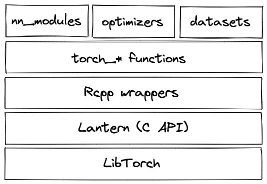

```{r setup, include=FALSE}
library(learnr)
library(torch)
library(luz)
library(torchvision)
library(tidyverse)
library(tsibble)
library(tsibbledata)
library(lubridate)
library(fable)
library(feasts)
library(zeallot)

knitr::opts_chunk$set(echo = FALSE)
```

## Bienvenu(e)s !

Aujourd'hui, on va vous montrer comment faire de l'apprentissage automatique avec `torch` et son API de haut niveau, `luz`.

### `torch`

`torch` est un cadre natif R pour le calcul rapide de tableaux avec différenciation automatique et de riches fonctionnalités de réseaux neuronaux.

`torch` est implémenté en R et C++, tout en déléguant à LibTorch pour les opérations de plus bas niveau.

](torch_arch.png "torch architecture")

### `luz`

Ce que `keras` est à `tensorflow` -- une API de haut niveau qui uniformise et instrumente l'apprentissage -- `luz` est à `torch`. Alors que tout peut être accompli avec `torch` seul, `luz` peut être d'une aide énorme, en tant que

-   fournissant une interface déclarative à l'apprentissage, assez semblable à *keras*

-   éliminant du code générique

-   surveillant des métriques souvent utilisées en science de données, et permettant aux utilisateurs d'en définir ses propres mesures

-   fournissant un ensemble de *rappels* prêts à l'emploi afin de contrôler l'apprentissage, sauvegarder l'état du modèle, etc.

-   définant une interface simple pour créer vos propres rappels

### Écosystème

-   [torch](https:/github.com/mlverse/torch)

-   [luz](https:/github.com/mlverse/luz)

-   [torchvision](https:/github.com/mlverse/torchvision)

-   [torchdatasets](https:/github.com/mlverse/torchdatasets)

-   [tabnet](https:/github.com/mlverse/tabnet)

-   ... et plus encore !

### Nos objectifs pour aujourd'hui

1.  Comprendre et utiliser les tenseurs `torch` et les modules de réseaux neuronaux ; comprendre et appliquer la différenciation automatique.

2.  Utiliser `luz` pour entraîner des réseaux neuronaux de manière déclarative.

3.  Démarrer avec la prévision des séries temporelles avec `torch`.

### Prérequis

Pour suivre ce tutoriel, vous devez installer les paquets suivants :

```{r, eval=FALSE, echo=TRUE}
library(learnr)
library(torch)
library(luz)
library(torchvision)
library(tidyverse)
library(tsibble)
library(tsibbledata)
library(lubridate)
library(fable)
library(feasts)
library(zeallot)
```

## `torch` tenseurs, modules, and autograd

### Tenseurs

#### Créer des tenseurs

##### Méthode 1 : A partir des valeurs R

Les tenseurs peuvent être créés directement à partir de valeurs R en utilisant `torch_tensor().` En option, nous pouvons définir les attributs du tenseur, y compris le type de données, le dispositif sur lequel il vit, et plus encore.

Ici, nous créons des tenseurs unidimensionnels (donc, des vecteurs) :

```{r, eval=FALSE, echo=TRUE}
torch_tensor(1)
torch_tensor(1, dtype = torch_int())
torch_tensor(1, device = "cuda")

torch_tensor(c(1, 2, 3)) # tenseur flottant
```

Des tenseurs bidimensionnels peuvent être créés à partir de matrices R.

```{r, eval=FALSE, echo=TRUE}
torch_tensor(matrix(1:9, ncol = 3)) # tenseur entier
torch_tensor(matrix(1:9, ncol = 3))$to(dtype = torch_float()) # convertir en flottant

torch_tensor(matrix(1:9, ncol = 3, byrow = TRUE))
```

Des tenseurs de plus haute dimension peuvent être créés à partir de tableaux R, mais il est normalement plus facile d'utiliser les fonctions de création en masse.

##### Méthode 2 : Fonctions de création en masse.

Des tenseurs multidimensionnels suivant un certain modèle définissable sont créés en passant en tant qu'argument la dimensionnalité souhaitée. Quelques exemples (il en existe d'autres) :

```{r, eval=FALSE, echo=TRUE}
torch_zeros(c(3, 3))
torch_rand(c(3, 3))

```

Un autre type de fonction souvent utilisé consiste à spécifier la plage souhaitée :

```{r, eval=FALSE, echo=TRUE}
torch_arange(1, 9)
torch_logspace(start = 0.1, end = 1.0, steps = 5)
```

#### Reconversion en R

Les tenseurs sont reconvertis en R en utilisant `as.numeric()`, `as.matrix()`, ou `as.array()` :

```{r, eval=FALSE, echo=TRUE}
torch_tensor(2) %>% as.numeric()

torch_ones(c(2, 2)) %>% as.matrix() 

torch_ones(c(2, 2, 2)) %>% as.array() 
```

#### Opérations sur les tenseurs

Il y a un grand nombre d'opérations qui peuvent être effectuées sur les tenseurs. En général, il existe une paire de fonction (non associée à un objet) et de méthode correspondante ("appartenant" à une instance de tenseur) qui font la même chose :

```{r, eval=FALSE, echo=TRUE}
t1 <- torch_tensor(c(1, 2, 3))
t2 <- torch_tensor(c(1, 2, 3))

torch_add(t1, t2)
t1$add(t2)
```

Dans les deux cas, les tenseurs originaux ne sont pas modifiés du tout ; par contre, un nouvel objet est créé. Normalement, vous alliez simplement l'assigner à une nouvelle variable :

```{r, eval=FALSE, echo=TRUE}
t3 <- t1$add(t2)

t1
t3
```

Dans les rares cas où vous devez modifier le tenseur original, vous pouvez utiliser les variantes trait de soulignement correspondantes :

```{r, eval=FALSE, echo=TRUE}
t1$add_(t2)
t1
```

Voici quelques-unes des nombreuses opérations matricielles disponibles. `$mul()` effectue une multiplication par éléments ; `$matmul()` effectue une multiplication matricielle ; `$dot()` calcule le produit scalaire :

```{r, eval=FALSE, echo=TRUE}
t1$mul(t2)

# fonctionnent tous les deux(en torch, il n'y a pas de concept de vecteur ligne vs colonne)
t1$matmul(t2)
t1$t()$matmul(t2)

t1$dot(t2)
```

Vous pouvez voir que `torch` ne fait pas de distinction entre les vecteurs ligne et colonne. Ci-dessus, `$t()` transpose le vecteur `t1`, mais la multiplication matricielle fonctionnera sans.

#### Remodeler des tenseurs

Souvent, vous aurez besoin de remodeler un tenseur. Parmi les opérations les plus courantes, citons `$squeeze()` et `$unsqueeze()`. La première supprime une dimension singleton à la position spécifiée (où singleton signifie que la dimension est de longueur 1) :

```{r, eval=FALSE, echo=TRUE}
t1 <- torch_randn(c(1, 2, 3, 4))
t1

t1$squeeze(1)
```

Le dernier, par contre, ajoute une dimension singleton :

```{r, eval=FALSE, echo=TRUE}
t1$unsqueeze(4)
```

Cela ne fonctionne que pour les dimensions singleton. `$view()`, en revanche, fonctionne pour un remodelage arbitraire, à condition que le nombre d'éléments le permette. `t1`, ci-dessus, à 24 valeurs, qui pourraient aussi bien être arrangées en 6x4 ou 1x24 :

```{r, eval=FALSE, echo=TRUE}
t2 <- t1$view(c(6, 4))

t3 <- t1$view(24)

```

En fait, `$view()` ne crée pas réellement un tenseur nouveau ; au lieu de cela, cette méthode arrange pour que la nouvelle référence se réfère toujours au même emplacement en mémoire, et stocke juste quelques métadonnées qui indiquent à `torch` comment interpréter les octets respectifs. Il y a des situations où `$view()` ne peut pas être utilisé ; dans ce cas, vous pouvez toujours utiliser `$reshape()` à sa place. Contrairement à `$view()`, `$reshape()` fera une copie physique si nécessaire.

#### Indexation et découpage en tranches

L'indexation dans `torch` est basée sur 1, tout comme en R en général. Et tout comme en R, les dimensions singleton seront abandonnées - sauf si vous spécifiez `drop = FALSE` :

```{r, eval=FALSE, echo=TRUE}
t1

t1[ , 1, , ]
t1[ , 1, , , drop = FALSE]

```

Les plages de valeurs ("tranches") se peuvent accéder en utilisant le point-virgule :

```{r, eval=FALSE, echo=TRUE}
t1[1, 1, 1:2, ]
t1[1, 1, 1:2, , drop = FALSE]
```

Un raccourci qui n'existe pas en R (où la même syntaxe a une sémantique différente), l'indice -1 est utilisé pour faire référence au dernier élément d'une dimension singleton :

```{r, eval=FALSE, echo=TRUE}
t2 <- torch_tensor(1:17)
t2[-1] 
```

#### Diffusion ("broadcasting")

Dans `torch`, les tenseurs peuvent être diffusés. Le principe est le même que lorsque, en R, on ajoute un scalaire à chaque élément d'un vecteur. Mais ça va plus loin que cela. Nous n'avons pas le temps d'expliquer les règles en détail, mais nous montrons quelques exemples. (Ainsi qu'un énoncé bref des règles, pour que vous puissiez y revenir plus tard.)

Ici, nous "ajoutons" une matrice et un vecteur, ce qui fait que le vecteur est ajouté à chaque ligne de la matrice. Ceci n'est possible que parce que `t2` a une dimension singleton à l'avant.

```{r, eval=FALSE, echo=TRUE}
t1 <- torch_randn(c(3,5))
t2 <- torch_randn(c(1,5))

t1$add(t2)
```

L' exemple suivant est similaire, mais il implique une opération supplémentaire du côté de `torch` : `t2` est d'abord virtuellement étendu à la taille 1x5 (une dimension singleton est ajoutée devant). Ensuite, les choses se passent comme ci-dessus.

```{r, eval=FALSE, echo=TRUE}
t1 <- torch_randn(c(3,5))
t2 <- torch_randn(c(5))

t1$add(t2)
```

Comme dernier exemple, nous voyons ici à la fois l'ajout virtuel d'une dimension singleton (à `t1`) et la "réutilisabilité" des dimensions singleton montrée avant. Cette dernière idée est utilisée deux fois, pour `t1` ainsi que pour `t2`.

#### Annexe : Règles de diffusion

    # 1 Nous alignons les formes du tableau, en commençant par la droite.
      
      # Exemple

      # t1, forme :     8  1  6  1
      # t2, forme :        7  1  5
      

    # 2 En regardant à partir de la droite, les tailles le long des axes alignés doivent soit correspondre exactement, soit l'une d'entre elles doit être égale à 1.
    # Dans ce dernier cas, le tenseur à une dimension est diffusé vers le plus long.

      # Exemple : Cela se produit dans la dernière (pour t1) ainsi que dans l'avant-dernière dimension (pour t2).

      # t1, forme :     8  1  6  5
      # t2, forme :        7  6  5


    # 3 Si à gauche, l'un des tableaux a un axe supplémentaire (ou plus d'un),
    l'autre est virtuellement étendu pour avoir une taille de 1 à cet endroit.


    #  Ensuite, la diffusion se fera comme indiqué dans (2).

      # Exemple : Ça se passe dans la dimension la plus à gauche de t1. D'abord,   il y a une expansion virtuelle

      # t1, forme :     8  1  6  1
      # t2, forme :     1  7  1  5

      # et ensuite, la diffusion se produit :
      
      # t1, forme :     8  1  6  1
      # t2, forme :     8  7  1  5

#### Exercice : Tenseurs

Dans les exercices suivants, essayez de traduire le code R en opérations équivalentes `torch`.

1.  Créez deux tenseurs représentant respectivement une matrice et un vecteur :

```{r tensors1, exercise=TRUE, exercise.eval=TRUE}
# une matrice
m1 <- matrix(1:32, ncol = 8, byrow = TRUE)

# en réalité, un vecteur
m2 <- matrix(1:8, ncol = 1)

m1
m2
```

```{r tensors1-hint}
t1 <- torch_tensor(matrix(1:32, ncol = 8, byrow = TRUE))
t2 <- torch_tensor(1:8)

t1
t2
```

2.  Multipliez les matrices, mettez tous éléments en carré, faites leur somme, et prenez la racine carrée :

```{r tensors2, exercise=TRUE, exercise.eval=TRUE}
(m1 %*% m2)^2 %>% sum() %>% sqrt()
```

```{r tensors2-hint}
t1$matmul(t2)$square()$sum()$to(dtype = torch_float())$sqrt()
```

[Notez comment nous avons besoin de convertir en flottant afin d'être en mesure d'appeler `torch_sqrt()`.]

3.  Multipliez chaque ligne de `m1` par le vecteur `m2` (par éléments) :

```{r tensors3, exercise=TRUE, exercise.eval=TRUE}
m1 * rbind(t(m2), t(m2), t(m2), t(m2))
```

```{r tensors3-hint}
t1 * t2
```

[Notez comment la diffusion s'occupe de la duplication pour nous. Aussi, notez comment aucune transposition n'est nécessaire, car `torch` n'a aucun concept de vecteurs de ligne vs. vecteurs de colonne.]

4.  Transposez la matrice `m1`, et calculez les sommes des colonnes. (Cela devrait donner 4 valeurs).

```{r tensors4, exercise=TRUE, exercise.eval=TRUE}
t(m1) %>% apply(2, sum)
```

```{r tensors4-hint}

t1$t()$sum(dim = 1)
```

[Notez comment l'application de la somme sur la dimension 1 (et non 2) réduit les rangées. Essayez de le voir comme ceci : Étant donné un indice dans les dimensions, en R, nous pensons "grouper par". Dans `torch`, on pense "réduire".]

5.  Normalisez `m1` en soustrayant la moyenne et en divisant par l'écart-type.

```{r tensors5, exercise=TRUE, exercise.eval=TRUE}
(m1 - mean(m1)) / sd(m1)
```

```{r tensors5-hint}
t1 <- t1$to(dtype = torch_float())
(t1 - t1$mean()) / t1$std()
```

Tout comme `torch_sum()`, `torch_mean()` et `torch_std()` ont besoin que leur entrée soit de type `float`.

### Différenciation automatique avec autograd

#### Comment ça marche

`torch` autograd fournit de la différenciation automatique pour les opérations exécutées sur les tenseurs. Pour que cela se produise, le tenseur "source" (ou "feuille", comme `torch` l'appelle) - celui par rapport auquel nous voulons que les dérivés soient calculés - doit être créé avec `requires_grad = TRUE`. Appelons-le `a` :

```{r, eval=FALSE, echo=TRUE}
a <- torch_tensor(matrix(1:4, ncol = 2, byrow = TRUE), dtype = torch_float(), requires_grad = TRUE)

```

Dans cet exemple, `c`, la sortie, dépend de `a` via `b` :

```{r, eval=FALSE, echo=TRUE}
b <- a$mul(2)
c <- b$sum()
```

Jusqu'à présent, aucun dérivé n'a encore été calculé. Mais `torch` sait ce qu'il faut faire si nous le lui demandons. Plus précisément, il connaît les opérations concrètes pour lesquelles il va falloir les dérivées :

```{r, eval=FALSE, echo=TRUE}
c$grad_fn
b$grad_fn
```

Pour les faire calculer, appelez `$backward()`sur le tenseur de sortie :

```{r, eval=FALSE, echo=TRUE}
c$backward()
```

Maintenant, le gradient de `c` par rapport à `a` peut être trouvé dans le champ `$grad` de `a`.

```{r, eval=FALSE, echo=TRUE}
a$grad
```

Lorsque nous mettons à jour un tenseur "feuille", par exemple dans l'optimisation, nous ne voulons pas que `torch` enregistre cette opération pour le calcul ultérieur des dérivés. Dans ces cas, nous devons lui dire d'exempter l'opération en question du processus :

```{r, eval=FALSE, echo=TRUE}
     
with_no_grad( {
  a$sub_(0.1 * a$grad)
})

a
```

#### Minimiser une fonction avec autograd

Nous pouvons utiliser autograd pour minimiser une fonction. Nous définissons un paramètre pour contenir $\mathbf{x}$. Ensuite, dans une boucle, nous évaluons la fonction à la valeur courante de $\mathbf{x}$, calculons le gradient, et soustrayons une fraction du gradient de $\mathbf{x}$.

```{r, eval=FALSE, echo=TRUE}

# fonction à minimiser
f <- function(x) x^2 - 7

# on démarre à x = 11
param <- torch_tensor(11, requires_grad = TRUE)

# taux d'apprentissage  : fraction du gradient à soustraire
lr <- 0.1

for (i in 1:num_iterations) {
  
  # appeler la fonction sur la valeur du paramètre actuel

  # calculer le gradient de la valeur par rapport au paramètre

  # mettre à jour le paramètre

}
```

Dans l'exercice, il vous est demandé de compléter les pièces manquantes.

#### Exercice : Minimisation de fonction

Remplissez les lignes marquées "à compléter". Une fois le code exécuté, expérimentez avec le taux d'apprentissage et comparez les résultats. Quel est un bon taux d'apprentissage pour ce problème ?

```{r autograd, exercise=TRUE, exercise.eval=TRUE}
# fonction à minimiser
f <- function(x) x^2 - 7

# on démarre à x = 11
param <- torch_tensor(11, requires_grad = TRUE)

# taux d'apprentissage  : fraction du gradient à soustraire
lr <- 0.1

for (i in 1:10) {
  
  cat("Iteration : ", i, "\n")
  
  # appeler la fonction sur la valeur du paramètre actuel
  value <- 777 # à compléter
  cat("Value is : ", as.numeric(value), "\n")
  
  # calculer le gradient de la valeur par rapport au paramètre
  # à compléter
  # décommentez la ligne suivante quand vous êtes prêt
  # cat("Gradient is : ", as.matrix(param$grad), "\n")
  
  # mettre à jour le paramètre
  # envelopper dans with_no_grad()
  with_no_grad({
    # soustraire une fraction du gradient du paramètre
    # à compléter
    
    # mettre à zéro à chaque itération (sinon, il y aurait accumulation)
    # à compléter
  })
  
  cat("After update : Param is : ", as.matrix(param), "\n\n")
  
  if (abs(-7 - as.numeric(value)) < 0.00005) break
}
```

```{r autograd-hint}
f <- function(x) x^2 - 7

param <- torch_tensor(11, requires_grad = TRUE)

lr <- 0.5

for (i in 1:10) {
  
  cat("Iteration : ", i, "\n")
  
  value <- f(param)
  cat("Value is : ", as.numeric(value), "\n")

  value$backward()
  cat("Gradient is : ", as.matrix(param$grad), "\n")
  
  with_no_grad({
    param$sub_(lr * param$grad)
    param$grad$zero_()
  })
  
  cat("After update : Param is : ", as.matrix(param), "\n\n")
  
  if (abs(-7 - as.numeric(value)) < 0.00005) break
}

```

### Modules et optimiseurs

Bien que tout puisse être fait avec les tenseurs et autograd seuls, coder un grand réseau neuronal de cette manière serait une tâche assez lourde. Heureusement, ce n'est pas nécessaire. D'une part, `torch` fournit un ensemble riche de modules de réseaux neuronaux qui cachent la logique des couches ; et d'autre part, ses optimiseurs encapsulent des algorithmes d'optimisation connus pour leur efficacité dans l'apprentissage profond.

#### Modules de réseaux neuronaux

`torch` utilise le terme module pour les couches individuelles (par exemple, couche linéaire, couche convolutive ...) ainsi que pour les modèles, c'est-à-dire les réseaux neuronaux. La logique ici est que les modules sont composables ; un modèle/module n'est rien d'autre qu'une composition de modules plus petits, qui peuvent à nouveau contenir des modules encore plus petits, etc.

##### Module linéaire

Voici une transformation affine, codée manuellement :

```{r, eval=FALSE, echo=TRUE}
# données d'entrée
x <- torch_randn(c(7,2))

# poids
w <- torch_tensor(c(0.1, 0.1), requires_grad = TRUE)
# biais
b <- torch_tensor(0.5, requires_grad = TRUE)
  
x$matmul(w) + b  
```

Nous pouvons réaliser la même chose en utilisant un module linéaire :

```{r, eval=FALSE, echo=TRUE}
l <- nn_linear(in_features = 2, out_features = 1)
l(x)
```

Le résultat est différent de celui ci-dessus, parce que là nous avons défini le poids nous-mêmes. Par défaut, `torch` va initialiser les poids uniformément, avec des valeurs comprises entre `[-sqrt(num_features), sqrt(num_features)]`.

```{r, eval=FALSE, echo=TRUE}
l$weight 
```

Juste pour prouver le point, nous pouvons initialiser manuellement les poids du module:

```{r, eval=FALSE, echo=TRUE}
nn_init_constant_(l$weight, 0.1)
nn_init_constant_(l$bias, 0.5)

l(x)
```

Avec les modules, nous bénéficions gratuitement de la différenciation automatique. Supposons que l'on veuille minimiser la somme des sorties.

```{r, eval=FALSE, echo=TRUE}
loss <- l(x)$sum() 
loss$grad_fn
```

Nous devrons toujours appeler `$backward()`pour voir les dérivés en effet calculés. Ici, elles sont encore indéfinies :

```{r, eval=FALSE, echo=TRUE}
l$weight$grad
l$bias$grad
```

Appelant `$backward()` ...

```{r, eval=FALSE, echo=TRUE}
loss$backward()

l$weight$grad
l$bias$grad
```

##### Exemples d'autres modules

Il existe de nombreux autres modules. Voici un tenseur imitant une image RVB 32x32:

```{r, eval=FALSE, echo=TRUE}
img <- torch_rand(c(1, 3, 32, 32))
```

Maintenant, `nn_conv2d()` est utilisé pour créer une couche convolutive, et son filtre 3x3 est appliqué à l'image :

```{r, eval=FALSE, echo=TRUE}
conv <- nn_conv2d(in_channels = 3, out_channels = 1, kernel_size = 3, padding = 1)

conv(img)
```

Un autre module couramment utilisé dans le traitement des images est `nn_max_pool2d()` pour la réduction de la taille spatiale :

```{r, eval=FALSE, echo=TRUE}
pool <- nn_max_pool2d(kernel_size = 2)
conv(img) %>% pool()
```

Dans la troisième section de ce tutoriel, nous allons rencontrer des modules communs dans le traitement des séries temporelles.

##### Composer des modules

Pour construire un " modèle " à partir de " couches " telles que celles que nous avons montrées ci-dessus, nous pouvons utiliser `nn_sequential()`.

Voici un modèle composé de deux couches linéaires, avec entre elles un module ReLU (`nn_relu()`). ReLU est l'abréviation de "Rectified Linear Unit" (unité linéaire rectifiée) ; son but est d'introduire une certaine non-linéarité dans ce modèle :

```{r, eval=FALSE, echo=TRUE}
model <- nn_sequential(
  nn_linear(2, 16),
  nn_relu(),
  nn_linear(16, 1)
)

model$parameters

model(x)
```

Vous pouvez également définir vos propres modules. Nous en verrons des exemples dans la deuxième partie.

#### Optimiseurs

Parmi les optimiseurs les plus couramment utilisés dans l'apprentissage profond figurent Adam (`optim_adam()`), RMSProp (`optim_rmsprop()`), and Stochastic Gradient Descent (SGD ; `optim_sgd()`).

Ici, nous utilisons `optim_adam()` pour démontrer leur utilisation.

```{r, eval=FALSE, echo=TRUE}
# quelques données fictives
x <- torch_tensor(c(1.2, 0.8, 0.7))
y <- torch_tensor(1)
```

Lorsqu'un optimiseur est créé, il faut lui indiquer ce qu'il doit optimiser, à savoir les paramètres du modèle. La plupart des optimiseurs ont également besoin de recevoir le taux d'apprentissage.

```{r, eval=FALSE, echo=TRUE}
model <- nn_sequential(
  nn_linear(3, 8),
  nn_relu(),
  nn_linear(8, 1)
)

optimizer <- optim_adam(model$parameters, lr = 0.01)
```

Nous obtenons une prédiction :

```{r, eval=FALSE, echo=TRUE}
prediction <- model(x)
prediction
```

Nous utilisons ensuite l'une des fonctions de perte intégrées en `torch` pour calculer la perte (ici, l'erreur quadratique moyenne) :

```{r, eval=FALSE, echo=TRUE}
loss <- nnf_mse_loss(prediction, y)
loss
```

Nous appelons `$backward()` sur la perte pour que les gradients soient calculés :

```{r, eval=FALSE, echo=TRUE}
loss$backward()
```

Maintenant, les gradients sont connus, mais aucune modification n'a encore été apportée aux paramètres du modèle.

```{r, eval=FALSE, echo=TRUE}
model$parameters
```

L'appel de `$step()` sur l'optimiseur effectuera ces changements.

```{r, eval=FALSE, echo=TRUE}
optimizer$step()
```

```{r, eval=FALSE, echo=TRUE}
model$parameters
```

Lors de la formation effective d'un réseau, nous appelons l'optimiseur dans une boucle. Nous en montrons un exemple ci-dessous.

Tout d'abord, nous créons les données d'entraînement.

```{r, eval=FALSE, echo=TRUE}
# dimensionnalité de l'entrée (nombre de caractéristiques d'entrée)
d_in <- 3
# dimensionnalité de la sortie (nombre de caractéristiques prédites)
d_out <- 1
# nombre d'observations dans l'ensemble d'entraînement
n <- 100

# créer des données aléatoires
x <- torch_randn(n, d_in)
y <- x[, 1, NULL] * 0.2 - x[, 2, NULL] * 1.3 - x[, 3, NULL] * 0.5 + torch_randn(n, 1)

```

Ensuite, nous définissons le réseau.

```{r, eval=FALSE, echo=TRUE}
# dimensionnalité de la couche cachée
d_hidden <- 32

model <- nn_sequential(
  nn_linear(d_in, d_hidden),
  nn_relu(),
  nn_linear(d_hidden, d_out)
)

```

On crée l'optimiseur:

```{r, eval=FALSE, echo=TRUE}
learning_rate <- 0.08

# L'optimiseur applique les mises à jour du gradient pour nous
optimizer <- optim_adam(model$parameters, lr = learning_rate)
```

Et nous sommes prêts pour la boucle d'entraînement. Dans une boucle, nous

-   obtenons les prédictions du modèle ;

-   calculons la perte ; et

-   propageons la perte à travers le réseau et mettons à jour les paramètres.

Notez que lors d'une optimisation en boucle, nous devons remettre à zéro les gradients à chaque itération.

```{r, eval=FALSE, echo=TRUE}
for (t in 1:200) {
  
  ### -------- Passe avant -------- 
  y_pred <- model(x)
  
  ### -------- calculer la perte -------- 
  # erreur quadratique moyenne
  loss <- nnf_mse_loss(y_pred, y, reduction = "sum")
  if (t %% 10 == 0)
    cat("Epoch : ", t, "   Loss : ", loss$item(), "\n")
  
  ### -------- Rétropropagation -------- 
  
  # faut remettre à zéro les gradients avant le passage en arrière, car ils s'accumuleraient autrement.
  optimizer$zero_grad()
  
  # calculer les gradients 
  loss$backward()
  
  # mettre à jour les poids 
  optimizer$step()
}
```

Bien qu'elle soit beaucoup plus pratique que de travailler uniquement avec des tenseurs, cette méthode d'entraînement d'un réseau neuronal reste de très bas niveau et nécessite beaucoup d'attention pour les particularités (comme la mise à zéro des gradients). Dans la deuxième partie, nous verrons comment former des réseaux neuronaux de manière beaucoup plus confortable avec `luz`.

#### Exercice : Formation d'un réseau de neurones

Ci-dessous, vous trouverez le code de bout en bout pour former un réseau neuronal. Essayez de l'expérimenter un peu :

Si vous modifiez le taux d'apprentissage, que se passe-t-il ?

Essayez d'autres optimiseurs, tels que `optim_sgd()`. Comment cela affecte-t-il la formation ?

```{r modules, exercise=TRUE, exercise.eval=TRUE}
# dimensionnalité de l'entrée (nombre de caractéristiques d'entrée)
d_in <- 3
# dimensionnalité de la sortie (nombre de caractéristiques prédites)
d_out <- 1
# nombre d'observations dans l'ensemble d'entraînement
n <- 100

# créer des données aléatoires
x <- torch_randn(n, d_in)
y <- x[, 1, NULL] * 0.2 - x[, 2, NULL] * 1.3 - x[, 3, NULL] * 0.5 + torch_randn(n, 1)

# dimensionnalité de la couche cachée
d_hidden <- 32

model <- nn_sequential(
  nn_linear(d_in, d_hidden),
  nn_relu(),
  nn_linear(d_hidden, d_out)
)

learning_rate <- 0.08

# L'optimiseur applique les mises à jour du gradient pour nous
optimizer <- optim_adam(model$parameters, lr = learning_rate)

for (t in 1:200) {
  
  ### -------- Passe avant -------- 
  y_pred <- model(x)
  
  ### -------- calculer la perte -------- 
  # erreur quadratique moyenne
  loss <- nnf_mse_loss(y_pred, y, reduction = "sum")
  if (t %% 10 == 0)
    cat("Epoch : ", t, "   Loss : ", loss$item(), "\n")
  
  ### -------- Rétropropagation -------- 
  
  # faut remettre à zéro les gradients avant le passage en arrière, car ils s'accumuleraient autrement.
  optimizer$zero_grad()
  
  # calculer les gradients 
  loss$backward()
  
  # mettre à jour les poids 
  optimizer$step()
}
```

## Formation de réseaux neuronaux avec `luz`

`luz` est une API de haut niveau pour `torch` qui vous permet de former des réseaux de neurones dans un style déclaratif.

Avec `luz`, le flux global ressemble beaucoup à celui de Keras :

1.  Vous définissez un modèle.

2.  Vous utilisez `setup()`pour le configurer avec une fonction de perte, un optimiseur et un ensemble de métriques.

3.  Vous l'entraînez en utilisant `fit(),` en passant les données d'entraînement et (facultativement) de validation, ainsi que le nombre d'époques à entraîner et un ensemble de rappels (tous deux facultatifs).

### Exemple de bout en bout : MNIST

Pour présenter `luz`, nous allons faire le "bonjour au monde" de l'apprentissage profond : la classification de chiffres sur le (in-)célèbre jeu de données MNIST. MNIST est disponible comme partie du paquet `torchvision`.

#### Données

Dans `torch`, les données sont fournies à un réseau en utilisant des `dataset`s et des `dataloaders`. Leurs responsabilités respectives sont les suivantes :

-   `dataset` : Renvoie un seul élément de formation, de validation ou de test. Dans l'apprentissage supervisé, il s'agit d'une liste d'entrée et de cible. Optionnellement, s'occupe de tout prétraitement requis.

-   `dataloader` : Introduit les données dans le modèle. Normalement, cela se fait par lots de taille configurable. En option, un `dataloader` peut mélanger les données et organiser la parallélisation sur un sous-ensemble de processeurs disponibles.

`torchvision` est livré avec quelques jeux de données d'images, qui peuvent être demandés via `xxx_dataset()`. Ils seront téléchargés et préparés la première fois qu'ils sont instanciés (à moins que les données existent déjà dans l'emplacement spécifié).

Comme nous n'avons pas vraiment besoin de l'ensemble complet de données MNIST pour cette démonstration, nous ne préparons que la partie test (comme indiquée par la ligne `train = FALSE` ci-dessous). Nous la diviserons manuellement en parties formation et validation dans une minute.

Dans le constructeur du `dataset`, l'argument `transform =` sert à dire à torch comment les images doivent être prétraitées.

```{r, eval=FALSE, echo=TRUE}
dir <- "~/Downloads/mnist" 

ds <- mnist_dataset(
  dir,
  train = FALSE,
  transform = function(x) {
    x %>% transform_to_tensor() 
  }
)
```

`ds` a maintenant 10 000 paires image-étiquette :

```{r, eval=FALSE, echo=TRUE}
length(ds)
```

Nous pouvons utiliser l'indexation pour les inspecter :

```{r, eval=FALSE, echo=TRUE}
ds[1]
```

En utilisant `dataset_subset()`, nous divisons ces 10 000 paires en ensembles de formation et de validation :

```{r, eval=FALSE, echo=TRUE}
train_id <- sample.int(length(ds), size = 0.7*length(ds))
train_ds <- dataset_subset(ds, indices = train_id)
valid_ds <- dataset_subset(ds, indices = which( !seq_along(ds) %in% train_id))
```

Ensuite, nous créons les `dataloader`s respectifs.

```{r, eval=FALSE, echo=TRUE}
train_dl <- dataloader(train_ds, batch_size = 128, shuffle = TRUE)
valid_dl <- dataloader(valid_ds, batch_size = 128, shuffle = FALSE)
```

Avec `dataloader`s, `length()` indique le nombre des *lots* :

```{r, eval=FALSE, echo=TRUE}
length(train_dl)
length(valid_dl)
```

#### Modèle

Le modèle est un réseau neuronal convolutif qui filtre et réduit successivement ses entrées, pour arriver finalement à une prédiction de classe. Il y a dix types de chiffres (0-9), et pour chaque chiffre, il produira un score pour chacune des dix étiquettes possibles.

Dans la définition du modèle, notez le paramètre `num_classes`. Dans cet exemple, il n'y a pas de réel besoin de paramétrer le nombre de classes avec lesquelles le modèle peut travailler ; cependant, nous aimerions montrer comment avec `luz`, vous pouvez garder la définition du modèle flexible et ne passer la configuration désirée qu'au moment de la formation.

```{r, eval=FALSE, echo=TRUE}
net <- nn_module(
  "Net",
  initialize = function(num_classes) {
    self$conv1 <- nn_conv2d(1, 32, 3, 1)
    self$conv2 <- nn_conv2d(32, 64, 3, 1)
    self$dropout1 <- nn_dropout2d(0.25)
    self$dropout2 <- nn_dropout2d(0.5)
    self$fc1 <- nn_linear(9216, 128)
    self$fc2 <- nn_linear(128, num_classes)
  },
  forward = function(x) {
    x %>% 
      self$conv1() %>% 
      nnf_relu() %>% 
      self$conv2() %>% 
      nnf_relu() %>% 
      nnf_max_pool2d(2) %>% 
      self$dropout1() %>% 
      torch_flatten(start_dim = 2) %>% 
      self$fc1() %>% 
      nnf_relu() %>% 
      self$dropout2() %>% 
      self$fc2()
  }
)
```

#### Formation

Maintenant que nous avons la définition du modèle, tout ce qui nous sépare de l'observation de son entraînement sont deux appels à `luz` : `setup()` et `fit()`.

-   En utilisant `setup()`, nous configurons la fonction de perte et l'optimiseur à utiliser ; de plus, nous pouvons demander le calcul d'un ensemble de métriques.

-   En appelant `fit()`, nous démarrons le processus d'apprentissage. Le premier argument est toujours le `dataloader` contenant les données d'entraînement ; les autres arguments sont facultatifs et incluent le nombre d'époques, et éventuellement un autre `dataloader` pour la validation.

Alors que `setup()` et `fit()` sont "obligatoires", `set_hparams()`, située entre les deux, ne l'est pas. Cette fonction peut être utilisée pour définir les variables utilisées dans le modèle ; ici, nous passons la valeur souhaitée pour le paramètre `num_classes` mentionné ci-dessus.

```{r, eval=FALSE, echo=TRUE}
fitted <- net %>%
  setup(
    loss = nn_cross_entropy_loss(),
    optimizer = optim_adam,
    metrics = list(
      luz_metric_accuracy()
    )
  ) %>%
  set_hparams(num_classes = 10) %>%
  fit(train_dl, epochs = 3, valid_data = valid_dl, verbose = TRUE)
```

#### Prédictions

Les prédictions peuvent être obtenues en utilisant `predict()`, en passant le modèle entrâiné et le `dataloader` pour lequel nous voulons que les prédictions soient calculées.

Ces prédictions ne sont rien d'autre que la sortie de la couche finale du modèle :

```{r, eval=FALSE, echo=TRUE}
preds <- predict(fitted, valid_dl)
preds[1:10, ]
```

La classe la mieux ajustée est celle pour laquelle la valeur du tenseur (le score) est la plus élevée. Si, à la place de scores non-normalisés, nous souhaitons des probabilités, nous pouvons faire passer les scores bruts par un `softmax` :

```{r, eval=FALSE, echo=TRUE}
(nnf_softmax(preds[1:10, ], dim = 2))$to(device = "cpu") %>% as.matrix() %>% round(2)
```

#### Sauvegarde et chargement de modèles

Pour compléter l'essentiel de `luz`, voici ses fonctions d'aide pour sauvegarder et charger les modèles :

```{r, eval=FALSE, echo=TRUE}
luz_save(fitted, "mnist-cnn.pt")
copy <- luz_load("mnist-cnn.pt")
```

### Exercice : Rappels

Les rappels offrent un moyen extrêmement flexible de personnaliser la routine d'entraînement. `luz` lui-même utilise des rappels en interne, par exemple pour calculer les métriques ou pour afficher la progression de l'entraînement.

Voici un rappel simple qui devient active à deux catégories de "temps" spécifiées :

1.  Lorsque l'entraînement est terminé pour un seul lot (`on_train_batch_end()`).

2.  Quand l'entraînement a terminé une époque complète (`on_epoch_end()`).

```{r, eval=FALSE, echo=TRUE}
print_callback <- luz_callback(
  
  name = "print_callback",
  
  initialize = function(message) {
    self$message <- message
  },
  
  on_train_batch_end = function() {
    cat("Iteration ", ctx$iter, "\n")
  },
  
  on_epoch_end = function() {
    cat(self$message, "\n")
  }
)
```

Les rappels sont passés à `luz` dans l'appel `fit()` :

```{r, eval=FALSE, echo=TRUE}
fitted <- net %>%
  setup(...) %>%
  fit(..., callbacks = list(
    print_callback(message = "Fini !")
  ))
```

Via une référence de contexte (`ctx`), les rappels ont accès à un grand nombre d'objets internes au modèle et dépendants du processus, tels que le modèle lui-même, une liste d'optimiseurs utilisés, l'époque actuelle, et plus encore.

Pour cet exercice, implémentez un rappel qui, à la fin de chaque époque, dit "Done with epoch \<n\>", et insérez-le dans la routine de formation.

```{r custom-callback, exercise=TRUE, exercise.eval=TRUE}
which_epoch_callback <- luz_callback(
  
  name = "which_epoch_callback",
  
  # TBD
  
  
)
```

```{r custom-callback-hint}
which_epoch_callback <- luz_callback(
  
  name = "which_epoch_callback",
  
  on_epoch_end = function() {
    cat("Terminé avec l'époch :", ctx$epoch, "\n")
  }
)
```

### Exercise : Créer sa propre métrique

Bien que `luz` fournisse un grand nombre de métriques, vous pouvez facilement implémenter les vôtres si nécessaire. Les objets métriques conservent des agrégats courants de l'indicateur en question. À chaque époque, les agrégats sont réinitialisés à leur valeur de départ (zéro, dans la plupart des cas).

Une métrique `luz` est un objet R6 avec trois méthodes :

-   `initialize()`, utilisée pour définir les valeurs de départ de chaque variable à suivre ;

-   `update()`, qui indique à `luz` comment mettre à jour ces variables à chaque étape de formation (ou de validation, respectivement) ; et

-   `compute()`, utilisée pour définir l'indicateur à renvoyer.

Ci-dessous, vous serez chargé d'implémenter vous-même la précision. Voici un aperçu de ce qu'il faut faire :

```{r, eval=FALSE, echo=TRUE}
my_accuracy <- luz_metric(
  abbrev = "my_acc", 
  
  initialize = function() {
    # initialiser deux champs :
    # un pour contenir le nombre de prédictions correctes
    # un pour contenir le total courant des prédictions.
    # par exemple
    # self$correct <-
    # self$total <-
  },
 
  update = function(preds, target) {
    # 1 : utiliser pred (argument de la fonction n° 1) pour calculer les indices de la classe la plus probable (pour le lot complet).
    # pred <- 
    
    # 2 : mettre à jour self$correct : ajouter le nombre de prédictions correctes.
    # self$correct <- 
    
    # 3 : mettre à jour le total courant des prédictions
    # self$total <- 
  },
  
  compute = function() {
    # retourner la proportion de prédictions correctes
  }
)
```

Vous pouvez substituer votre propre implémentation de la précision dans le processus de formation, en remplaçant `luz_metric_accuracy()`. Avant de faire cela, testez votre implémentation de manière autonome, en la comparant avec l'implémentation officielle :

```{r, eval=FALSE, echo=TRUE}
preds_10 <- preds[1:10, ]
target_10 <- valid_ds[1:10]$y

metric <- luz_metric_accuracy()
metric <- metric$new()
metric$update(preds_10, target_10)
metric$compute()

metric2 <- my_accuracy()
metric2 <- metric2$new()
metric2$update(preds_10, target_10)
metric2$compute()
```

```{r custom-metric, exercise=TRUE, exercise.eval=TRUE}
my_accuracy <- luz_metric(
  abbrev = "my_acc", 
  
  initialize = function() {
    # initialiser deux champs :
    # un pour contenir le nombre de prédictions correctes
    # un pour contenir le total courant des prédictions.
    # par exemple
    # self$correct <-
    # self$total <-
  },
 
  update = function(preds, target) {
    # 1 : utiliser pred (argument de la fonction n° 1) pour calculer les indices de la classe la plus probable (pour le lot complet).
    # pred <- 
    
    # 2 : mettre à jour self$correct : ajouter le nombre de prédictions correctes.
    # self$correct <- 
    
    # 3 : mettre à jour le total courant des prédictions
    # self$total <- 
  },
  
  compute = function() {
    # retourner la proportion de prédictions correctes
  }
)
```

```{r custom-metric-hint}
my_accuracy <- luz_metric(
  abbrev = "my_acc", 
  
  initialize = function() {
    self$correct <- 0
    self$total <- 0
  },
 
  update = function(preds, target) {
    pred <- torch::torch_argmax(preds, dim = 2)
    self$correct <- self$correct + 
      (pred == target)$
      to(dtype = torch::torch_float())$
      sum()$
      item()
    self$total <- self$total + pred$numel()
  },
  
  compute = function() {
    self$correct/self$total
  }
)
```

## Prévision de séries temporelles

Pour illustrer la prévision de séries temporelles avec `torch`, nous utilisons l'ensemble de données `vic_elec`, disponible via le paquet `tsibbledata`. Il fournit trois années de demande d'électricité à la demi-heure pour Victoria, Australie, augmentée par des informations de température de même résolution et un indicateur de vacances quotidien.

Pour un apprentissage plus rapide, nous agrégeons les données par jour. Nous jetons tout sauf la demande elle-même, en nous basant exclusivement sur la série univariée.

```{r, eval=FALSE, echo=TRUE}
vic_elec_daily <- vic_elec %>%
  select(Time, Demand) %>%
  index_by(Date = date(Time)) %>%
  summarise(
    Demand = sum(Demand) / 1e3) 
```

Pour avoir rapidement une idée de ce à quoi nous avons affaire, il est pratique d'utiliser `feasts::STL()`.

```{r, eval=FALSE, echo=TRUE}
cmp <- vic_elec_daily %>% 
  model(STL(Demand)) %>% 
  components()

cmp %>% autoplot()

```

Avant de créer un `dataset`, un `dataloader` et un modèle, parlons rapidement de la prédiction de séries temporelles avec l'apprentissage profond en général.

### La prévision des séries chronologiques avec l'apprentissage profond en bref

Dans un modèle linéaire, les observations individuelles sont indépendantes. Leur ordre n'a pas d'importance. Il en va de même pour les ensembles d'images (pas les pixels d'un image, cependant).

Mais avec les séquences, comme le langage parlé ou les mesures consécutives dans le temps, l'ordre est essentiel. Nous avons donc besoin de modèles de réseaux neuronaux qui respectent la séquentialité.

Traditionnellement, le type de données dont nous parlons est le domaine des réseaux neuronaux récurrents (RNN). Ils sont dits récurrents car, en plus de traiter un nouvel élément de lot à chaque pas de temps (d'entrâinement), ils conservent - et mettent à jour en permanence - un état interne. Cet état est souvent appelé l'état caché.

Dans cette famille des RNN, les architectures les plus établies sont l'unité récurrente à grille (GRU) et la mémoire à long terme (LSTM). La LSTM diffère de la GRU en ce qu'elle conserve un état interne supplémentaire, parfois appelé état de cellule, qui lui permet de se souvenir à plus long terme. Dans ce tutoriel, nous utilisons uniquement les GRU, mais l'adaptation du code pour les LSTM est un effort gérable.

Pour que les RNN puissent apprendre les dépendances temporelles, les données doivent être préparées de manière à ce que chaque élément du lot contienne des informations sur plusieurs étapes temporelles. Voyons comment cela fonctionne.

### Création d'un `dataset` pour la prévision de séries temporelles

Dans notre introduction à `luz`, nous avons pu utiliser un objet de jeu de données préexistant, à savoir `mnist_dataset()` fourni par `torchvision`. Maintenant, nous allons construire un jeu de données personnalisé.

#### L'objet `dataset`

Les `dataset` sont des objets R6 qui implémentent trois méthodes : `initialize()`, `.getitem()`, et `.length()`. Ici

-   `initialize()`est l'endroit où les données sont stockées dans des variables d'instance (et éventuellement, prétraitées) ;

-   `.length()` indique à l'appelant (un `dataloader`, en général) combien d'éléments il y a dans le `dataset`; et

-   `.getitem()` définit ce qui doit être renvoyé sous la forme d'une seule paire \<source, cible\> (c'est-à-dire `(x,y)` ). Le dernier de ces éléments est celui où la "logique commerciale" fait surface.

#### Un `dataset` de séries temporelles pour la prédiction à un pas d'avance

Pour que chaque élément du lot contienne des informations sur une séquence, `x` doit être un vecteur de mesures consécutives. Combien de mesures ? Cela dépend de ce que nous savons de la série temporelle (ainsi que de l'expérimentation).

Quant à `y`, il dépend du nombre de pas de temps que nous voulons prévoir à l'avance. Ici, nous commençons par un seul pas. (Nous adapterons cela pour une prédiction à plusieurs étapes plus tard).

Pour permettre l'expérimentation avec le nombre de pas de temps qu'on utilise à apprendre, nous rendons `elec_dataset()` configurable à cet égard (voir le paramètre `n_timesteps` passé à `initialize()`).

Ensuite, pour chaque élément, le `dataset` renvoie une liste de `(x,y)`, où `x` est un vecteur d'observations consécutives (commençant à l'indice actuel), et `y` est la mesure juste après :

```{r, eval=FALSE, echo=TRUE}
elec_dataset <- dataset(
  name = "elec_dataset",
  
  initialize = function(x, n_timesteps) {
    
    self$n_timesteps <- n_timesteps
    self$x <- torch_tensor((x - train_mean) / train_sd)

  },
  
  .getitem = function(i) {
    
    start <- i
    end <- start + self$n_timesteps - 1
    
    list(
      x = self$x[start:end],
      y = self$x[end + 1]
    )
    
  },
  
  .length = function() {
    length(self$x) - self$n_timesteps
  }
)
```

Maintenant, nous créons des instances d'un tel `dataset` pour la formation et la validation. Nous devons d'abord extraire la caractéristique de la demande à partir du `tsibble` :

```{r, eval=FALSE, echo=TRUE}
elec_train <- vic_elec_daily %>% 
  filter(year(Date) %in% c(2012, 2013)) %>%
  as_tibble() %>%
  select(Demand) %>%
  as.matrix()

elec_valid <- vic_elec_daily %>% 
  filter(year(Date) == 2014) %>%
  as_tibble() %>%
  select(Demand) %>%
  as.matrix()

```

Pour améliorer les performances de formation, nous normalisons les données. À cette fin, nous calculons la moyenne et l'écart-type de l'ensemble d'entraînement :

```{r, eval=FALSE, echo=TRUE}
train_mean <- mean(elec_train)
train_sd <- sd(elec_train)
```

D'après l'inspection, deux semaines semblent être une période raisonnable pour tirer des enseignements :

```{r, eval=FALSE, echo=TRUE}
n_timesteps <- 7 * 2

train_ds <- elec_dataset(elec_train, n_timesteps)
valid_ds <- elec_dataset(elec_valid, n_timesteps)

length(train_ds)
```

Vérifions que le `dataset` renvoie ce que nous attendons de lui.

`x`, à un indice arbitraire, devrait être une matrice, avec quatorze lignes et une seule colonne, où la colonne correspond à la caractéristique unique, et les lignes contiennent les mesures consécutives. `y`, d'autre part, devrait être un vecteur de longueur un.

```{r, eval=FALSE, echo=TRUE}
train_ds[1]
```

#### Création des `dataloader`s réspectifs

```{r, eval=FALSE, echo=TRUE}
batch_size <- 32

train_dl <- train_ds %>% dataloader(batch_size = batch_size, shuffle = TRUE)

valid_dl <- valid_ds %>% dataloader(batch_size = batch_size)

```

Bien qu'il n'y ait rien de nouveau dans les appels à `dataloader()` ici, il est intéressant de vérifier la forme des lots qu'il renvoie.

```{r, eval=FALSE, echo=TRUE}
b <- dataloader_make_iter(train_dl) %>% dataloader_next()
b

```

Un lot de `xs` a maintenant la forme (32, 14, 1). Étant donné qu'après le regroupement, les éléments du lot se trouvent dans la dimension la plus à gauche, les étapes temporelles consécutives sont maintenant situées dans la deuxième dimension à partir de la gauche.

Cela s'avérera important en raison de la forme des entrées attendues par les RNN.

### Modèle

Le modèle est essentiellement une enveloppe pour un RNN, avec une couche linéaire supplémentaire qui produit une prédiction unique.

#### En savoir plus sur les GRU

Avant d'examiner la manière dont le modèle utilise le RNN (un GRU), examinons comment un GRU se comporte individuellement. Nous voudrons savoir

-   quels arguments il attend à l'instanciation ;

-   les arguments qu'il attend lorsqu'il est appelé ; et

-   ce qu'il retourne.

Tout d'abord, pour créer un GRU, nous devons au moins lui transmettre le nombre de caractéristiques d'entrée et le nombre d'unités dans la couche cachée. Si nos données ont des éléments de lot dans leur première dimension, nous devons également passer `batch_first = TRUE`. Par exemple :

```{r, eval=FALSE, echo=TRUE}
gru <- nn_gru(
  input_size = 1, # nombre de caractéristiques d'entrée
  hidden_size = 5, # nombre de caractéristiques cachées (et de sortie !)
  batch_first = TRUE 
)
```

Deuxièmement, le format d'entrée attendu (à condition que nous ayons créé le module "batch first", comme nous l'avons fait ci-dessus) est : `(batch_size, num_timesteps, num_features)`.

Voici quelques données aléatoires qui répondent aux exigences :

```{r, eval=FALSE, echo=TRUE}
# lot de 4, avec 8 pas de temps chacun et une seule caractéristique
input <- torch_randn(c(4, 8, 1))
```

Enfin, le module GRU retourne une liste de deux choses :

-   la sortie, de forme (`batch_size, num_timesteps, num_hidden`) . (Encore une fois, en présupposant "batch-first").

-   l'état caché final pour le dernier pas de temps seulement, de la forme (`1, batch_size, num_hidden`).

Pour un GRU (par opposition à un LSTM), il n'y a pas de différence entre l'état caché et l'état de sortie quand il s'agit du dernier pas de temps, donc le deuxième tenseur dans la liste ci-dessus ne fournit aucune information supplémentaire.

```{r, eval=FALSE, echo=TRUE}
gru(input)

```

#### Module de prédiction complet

Le modèle prend la sortie du dernier pas de temps et la transmet à la couche de sortie linéaire, ce qui donne une seule valeur prédite.

```{r, eval=FALSE, echo=TRUE}
model <- nn_module(
  
  initialize = function(input_size, hidden_size) {

    self$rnn <- nn_gru(
        input_size = input_size,
        hidden_size = hidden_size,
        batch_first = TRUE
      )
    
    self$output <- nn_linear(hidden_size, 1)
    
  },
  
  forward = function(x) {
    
    # liste de [output, hidden]
    # nous ne sommes intéressés que par le dernier pas de temps, nous pouvons donc utiliser directement [[2]].
    # mais nous voulons supprimer la dimension singleton inutile sur la gauche.
    x <- self$rnn(x)[[2]]$squeeze(1)

    x %>% self$output() 
  }
  
)

```

### Formation

```{r, eval=FALSE, echo=TRUE}
fitted <- model %>%
  setup(
    loss = nn_mse_loss(),
    optimizer = optim_adam,
    metrics = list(
     luz_metric_mse()
    )
  ) %>%
  set_hparams(input_size = 1, hidden_size = 64) %>%
  fit(train_dl, epochs = 20, valid_data = valid_dl, verbose = TRUE)
```

### Prédictions en période de test

Pour les tests et les graphiques, utilisons les quatre premiers mois de l'ensemble de validation. (En raccourcissant la fenêtre temporelle, on obtiendra un tracé plus utile).

```{r, eval=FALSE, echo=TRUE}
vic_elec_test <- vic_elec_daily %>% 
  filter(year(Date) %in% c(2014), month(Date) %in% 1:4) 

elec_test <- vic_elec_test %>%
  as_tibble() %>%
  select(Demand) %>%
  as.matrix()

test_ds <- elec_dataset(elec_test, n_timesteps)

test_dl <- test_ds %>% dataloader(batch_size = batch_size)

```

En utilisant `luz` pour obtenir les prédictions :

```{r, eval=FALSE, echo=TRUE}
preds <- predict(fitted, test_dl)
preds <- as.numeric(preds)
```

On peut les comparer aux cibles :

```{r, eval=FALSE, echo=TRUE}
preds <- c(rep(NA, n_timesteps), preds)

preds_ts <- vic_elec_daily %>% 
  filter(year(Date) %in% c(2014), month(Date) %in% 1:4) %>%
  add_column(forecast = preds * train_sd + train_mean) %>%
  pivot_longer(-Date) %>%
  update_tsibble(key = name)

preds_ts %>%
  autoplot() +
  scale_colour_manual(values = c("#08c5d1", "#00353f")) +
  theme_minimal()


```

### Exercice : Extension du modèle à la prévision à plusieurs étapes

Souvent, nous voulons prévoir plus loin dans le futur qu'une seule étape temporelle. Dans un exercice étendu, vous adapterez le `dataset` et le modèle pour permettre une prédiction à plusieurs étapes.

#### Changements requis

##### `dataset`

Dans le `dataset`, nous distinguons maintenant le nombre de pas de temps sur lequel baser l'apprentissage (`n_timesteps`), et le nombre de pas de temps à prévoir (`n_forecast`).

Dans `.getitem()`, le tenseur retourné en `x` reste inchangé, tandis qu'en `y`, nous retournons les valeurs `n_forecast` immédiatement après la dernière composante de `x`.

En raison de la nouvelle logique, `.length()`devra également être modifié.

##### Modèle

Le modèle doit maintenant produire `n_forecast` valeurs. Le moyen le plus simple d'y parvenir est de faire en sorte que la couche linéaire finale renvoie `n_forecast` valeurs prévisionnelles au lieu d'une seule. Cependant, en fonction des données, cela peut ou non donner des performances satisfaisantes.

Au lieu de cela, nous pouvons enchaîner plusieurs couches linéaires, reliées par des non-linéarités. Autrement dit, nous aurons un "réseau dans le réseau" - le GRU sera suivi d'un réseau à propagation directe, également appelé *perceptron multicouche* (*MLP*).

Dans cette deuxième approche, nettement plus puissante, il est facile de s'adapter de manière excessive à l'ensemble de formation. Pour contrer l'adaptation excessive, nous ajoutons une couche *dropout*. Avec le dropout, une quantité configurable d'aléatoire est ajoutée durant la période d'entrâinement (mais pas durant celles de validation et de test). Techniquement, ceci est réalisé en mettant à zéro de manière aléatoire la fraction souhaitée d'éléments dans le tenseur d'entrée de la couche.

Vous trouverez ci-dessous des instructions pour mettre en œuvre la deuxième solution.

#### Exercice partie 1 : Adaptation du `dataset`

Commencez par effectuer les changements mentionnés ci-dessus dans le `dataset`.

```{r multi-step-ds, exercise=TRUE, exercise.eval=TRUE}
elec_dataset <- dataset(
  name = "elec_dataset",
  
  initialize = function(x, n_timesteps, n_forecast) {
    
  },
  
  .getitem = function(i) {
    
  
  },
  
  .length = function() {
    
  }
)

```

```{r multi-step-ds-hint}
elec_dataset <- dataset(
  name = "elec_dataset",
  
  initialize = function(x, n_timesteps, n_forecast) {
    
    self$n_timesteps <- n_timesteps
    self$n_forecast <- n_forecast
    self$x <- torch_tensor((x - train_mean) / train_sd)

  },
  
  .getitem = function(i) {
    
    start <- i
    end <- start + self$n_timesteps - 1
    pred_length <- self$n_forecast
    
    list(
      x = self$x[start:end],
      y = self$x[(end + 1):(end + pred_length)]$squeeze(2)
    )
    
  },
  
  .length = function() {
    length(self$x) - self$n_timesteps - self$n_forecast + 1
  }
)

```

Une fois que vous avez mis à jour la définition du `dataset`, vous devez recréer `train_ds` et `valid_ds`. Choisissez un nombre pour la fenêtre de prévision (`n_forecast`), par exemple quatorze jours :

```{r, eval=FALSE, echo=TRUE}
n_timesteps <- 7 * 2
n_forecast <- 7 * 2 

train_ds <- elec_dataset(elec_train, n_timesteps, n_forecast)

valid_ds <- elec_dataset(elec_valid, n_timesteps, n_forecast)
```

Pour vérifier votre implémentation, assurez-vous que

```{r, eval=FALSE, echo=TRUE}
length(train_ds)
train_ds[1]
```

fonctionne correctement.

Pour passer à l'étape suivante, vous devez également recréer les `dataloader`s.

```{r, eval=FALSE, echo=TRUE}
batch_size <- 32
train_dl <- train_ds %>% dataloader(batch_size = batch_size, shuffle = TRUE)

valid_dl <- valid_ds %>% dataloader(batch_size = batch_size)
```

#### Exercice partie 2 : Adaptation du modèle

Maintenant, adaptez le modèle, dans le sens décrit ci-dessus.

```{r multi-step-model, exercise=TRUE, exercise.eval=TRUE}
model <- nn_module(
  
  # pour éviter de coder en dur des valeurs spécifiques, vous pouvez ajouter d'autres "hparams" ici
  initialize = function(input_size, hidden_size, ...) {
    
    self$rnn <- nn_gru(
        input_size = input_size,
        hidden_size = hidden_size,
        batch_first = TRUE
      )
    
    # un perceptron multicouche, utilisant nn_dropout avant la couche de sortie
    self$mlp <- nn_sequential(
      
      
      
    )
    
  },
  
  forward = function(x) {
    
    
    
  }
  
)

```

```{r multi-step-model-hint}
model <- nn_module(
  
  initialize = function(input_size, hidden_size, linear_size, output_size, dropout = 0) {
    
    self$rnn <- nn_gru(
        input_size = input_size,
        hidden_size = hidden_size,
        batch_first = TRUE
      )
    
    self$mlp <- nn_sequential(
      nn_linear(hidden_size, linear_size),
      nn_relu(),
      nn_dropout(dropout),
      nn_linear(linear_size, output_size)
    )
    
  },
  
  forward = function(x) {
    
    x <- self$rnn(x)
    # pass last timestep of RNN output to MLP
    x[[1]][ ,-1, ..] %>% 
      self$mlp()
    
  }
  
)

```

#### Exercice partie 3 : Formation

L'entraînement ressemble beaucoup à l'exercice précédent, à part le fait que vous devrez définir plus de `hparams`.

```{r multi-step-fit, exercise=TRUE, exercise.eval=TRUE}
#fitted <-
```

```{r multi-step-fit-hint}
fitted <- model %>%
  setup(
    loss = nn_mse_loss(),
    optimizer = optim_adam,
    metrics = list(
     luz_metric_mse()
    )
  ) %>%
  set_hparams(input_size = 1, hidden_size = 64, linear_size = 128,
             output_size = n_forecast, dropout = 0.5) %>%
  fit(train_dl, epochs = 20, valid_data = valid_dl, verbose = TRUE)
```

Une fois que vous avez terminé, voici un code pour visualiser une sélection de séquences de prévisions (n'hésitez pas à l'adapter).

```{r, eval=FALSE, echo=TRUE}
preds <- predict(fitted, test_dl)
preds <- as.matrix(preds)
```

```{r, eval=FALSE, echo=TRUE}
test_pred1 <- preds[1, ]
test_pred1 <- c(rep(NA, n_timesteps), test_pred1, rep(NA, nrow(vic_elec_test) - n_timesteps - n_forecast))

test_pred2 <- preds[21, ]
test_pred2 <- c(rep(NA, n_timesteps + 20), test_pred2, rep(NA, nrow(vic_elec_test) - 20 - n_timesteps - n_forecast))

test_pred3 <- preds[41, ]
test_pred3 <- c(rep(NA, n_timesteps + 40), test_pred3, rep(NA, nrow(vic_elec_test) - 40 - n_timesteps - n_forecast))

test_pred4 <- preds[61, ]
test_pred4 <- c(rep(NA, n_timesteps + 60), test_pred4, rep(NA, nrow(vic_elec_test) - 60 - n_timesteps - n_forecast))

test_pred5 <- preds[81, ]
test_pred5 <- c(rep(NA, n_timesteps + 80), test_pred5, rep(NA, nrow(vic_elec_test) - 80 - n_timesteps - n_forecast))

preds_ts <- vic_elec_test %>% 
  add_column(
    ex_1 = test_pred1 * train_sd + train_mean,
    ex_2 = test_pred2 * train_sd + train_mean,
    ex_3 = test_pred3 * train_sd + train_mean,
    ex_4 = test_pred4 * train_sd + train_mean,
    ex_5 = test_pred5 * train_sd + train_mean) %>%
  pivot_longer(-Date) %>%
  update_tsibble(key = name)


preds_ts %>%
  autoplot() +
  scale_color_hue(h = c(80, 300), l = 70) +
  theme_minimal()

```

## Questions et réponses

Des questions ?

Restez en contact :

-   GitHub : [torch](https://github.com/torch), [luz](https://github.com/luz), ...

-   Discord : [torch for R](https://discord.com/invite/s3D5cKhBkx)

-   Blog : [RStudio AI Blog](https://blogs.rstudio.com/ai/)

Merci de votre attention !
